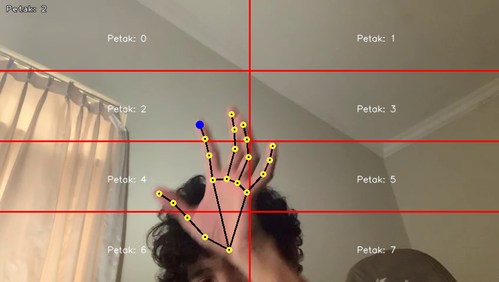

<div align="center">
  <h1>UR5 Controller ROS2 Humble Mediapie</h1>
  
</div>

---

This repository contains a ROS (Robot Operating System) node written in Python that integrates MediaPipe for perception tasks and controls relays based on detected hand gestures. The node subscribes to a specific ROS topic, processes hand tracking data using MediaPipe, and sends HTTP POST requests to a specified API endpoint to control relay states accordingly.

## Table of Contents

- [Prerequisites](#prerequisites)
- [Package Description](#package-description)
- [Installation](#installation)
- [Usage](#usage)
- [Contributing](#contributing)
- [License](#license)

## Prerequisites

- ROS1 (tested with [ROS1 distribution])
- Python 3.6+
- MediaPipe
- `rospy`, `requests`, `loguru` Python packages

## Package Description

### Overview

The node subscribes to the `perception/hand_petak` topic to receive `Int32` messages indicating which relay to control. It uses MediaPipe for hand tracking and gesture recognition, and controls relay states by sending HTTP POST requests to a configurable API endpoint.

### Features

- **ROS Integration**: Subscribes to `perception/hand_petak` topic.
- **MediaPipe Integration**: Uses MediaPipe for hand tracking and gesture recognition.
- **Relay Control**: Sends HTTP POST requests to control relay states.
- **Logging**: Utilizes the `loguru` library for logging.
- **Configurable API Endpoint**: API endpoint for relay control is configurable via command-line argument.

## Installation

Follow these steps to install and set up the package:

1. **Clone the repository**:

   ```bash
   git clone git@github.com:agus-darmawan/ros-ur5-controller-mediapipe.git
   cd ros-ur5-controller-mediapipe
   ```

2. **Build the package**:

   ```bash
   catkin_make
   ```

3. **Source the setup script**:
   ```bash
   source devel/setup.bash
   ```

## Usage

To run the system, follow these steps:

1. **Run the Perception node**:

   ```bash
   rosrun ur_perception hand_tracker_node.py 'source'
   ```

   note : source can be path of video file of source of the camera

2. **Run the Controller node**:
   ```bash
   rosrun ur_controller ur_controller_node.py 'API'
   ```
   note : API url post comand of esp inside the UR
